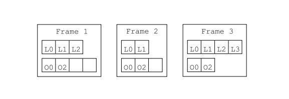

# 前言

本章解释了如何使用核心API生成和转换已编译的Java类。下文介绍了已编译类，然后介绍了相应的ASM接口、组件和生成和转换它们的工具，并提供了许多说白了的示例。方法、注释和泛型的内容将在接下来的章节中解释。

## 已编译类的结构

### 概述

已编译类的整体结构非常简单。实际上，与本机编译的应用程序不同，编译后的类保留了源代码中的结构信息和几乎所有符号。实际上，编译后的类包含:

- 该类的描述修饰符、名称、超类、接口和注解信息。
- 在这个类中声明的每个字段信息，包括字段的修饰符、名称、类型和注解。
- 在这个类中声明的每个方法和构造函数，包括方法的修饰符、名称、返回值和参数类型以及注解。它还以Java字节码指令序列的形式包含该方法的编译代码。

但是，源代码和已编译类之间存在一些差异：

- 已编译类只描述一个类，而源文件可以包含多个类。
- 已编译类不包含注释，但可以包含可用于将附加信息关联到这些元素的类、字段、方法和代码属性。但自从在Java 5中引入注解后，属性变得几乎毫无用处。
- 已编译类不包含包和导入部分，因此所有类型名称都必须是完全限定的。

另一个非常重要的结构差异是，编译类包含一个常量池部分。这个池是一个数组，包含类中出现的所有数值、字符串和类型常量。这些常量只在常量池节中定义一次，在类文件的所有其它部分中通过它们的索引引用。下表总结了编译后类的整体结构：

```bash
--------------------------------------
修饰符、名称、父类、实现的接口  
--------------------------------------
常量池：数字常量、字符串常量和类型常量
--------------------------------------
源文件名称（可选）
--------------------------------------
外层类的引用（如果当前类是内部类）
--------------------------------------
注解
--------------------------------------
属性
--------------------------------------
内部类|名称
--------------------------------------
字段   |修饰符、名称和类型
--------------------------------------
       |注解
--------------------------------------
       |属性
--------------------------------------
方法   |修饰符、名称、返回值和参数类型
--------------------------------------
       |注解
       |属性
       |编译后的代码
--------------------------------------
```

另一个重要的区别是Java类型在编译类和源类中的表示方式不同。下一节解释它们在编译类中的表示。

### 内部名称

在许多情况下，类型被限制为类或接口类型。例如，类的超类、类实现的接口或方法抛出的异常不能是基本类型或数组类型，而必须是类或接口类型。这些类型在具有内部名称的编译类中表示。类的内部名称就是这个类的完全限定名，其中点被斜杠代替。例如，String的内部名称为java/lang/String。

### 类型描述符

内部名称仅用于在已编译类中表示Java类型中的类或接口类型。在所有其他情况下，比如字段类型，Java类型是用类型描述符在已编译类中表示的。

源文件中的Java类型|类型描述符
--|--
boolean|Z
char|C
byte|B
short|S
int|I
float|F
long|J
double|D
Object|Ljava/lang/Object;
int[]|[I
Object[][]|[[Ljava/lang/Object;

基本类型的描述符是单个字符。类类型的描述符是这个类的内部名称，前面是L，后面是分号。最后，数组类型的描述符是一个方括号，后跟数组元素类型的描述符。

### 方法描述符

方法描述符是一个类型描述符列表，它在单个字符串中描述方法的参数类型和返回类型。方法描述符以左括号开头，后面是每个形式参数的类型描述符，然后是右括号，后面是返回类型的类型描述符。

源文件中的方法声明|方法描述符
--|--
void m(int i,float f)|(IF)V
int m(Object o)|(Ljava/lang/Object;)I
int[] m(int i,String s)|(ILjava/lang/String;)[I
Object m(int[] i)|([I)Ljava/lang/Object;

## 接口和组件

### 概述

用于生成和转换编译类的ASM API是基于ClassVisitor抽象类的。这个类中的每个方法都对应于同名的类文件结构部分。对于已编译类结构中的各个部分：
- 简单部分：使用无返回值的visitXxx()方法进行访问
- 复杂部分：使用返回辅助visitor类的visitAnnotation、visitField和visitMethod方法进行访问，它们分别返回一个AnnotationVisitor、一个FieldVisitor和一个MethodVisitor。

```java
public abstract class ClassVisitor {
    public ClassVisitor(int api);
    public ClassVisitor(int api, ClassVisitor cv);
    public void visit(int version, int access, String name,String signature, String superName, String[] interfaces);
    public void visitSource(String source, String debug);
    public void visitOuterClass(String owner, String name, String desc);
    AnnotationVisitor visitAnnotation(String desc, boolean visible);
    public void visitAttribute(Attribute attr);
    public void visitInnerClass(String name, String outerName,
    String innerName, int access);
    public FieldVisitor visitField(int access, String name, String desc,
    String signature, Object value);
    public MethodVisitor visitMethod(int access, String name, String desc,
    String signature, String[] exceptions);
    void visitEnd();
}
```
这些辅助类递归地使用相同的原则，例如：

```java
public abstract class FieldVisitor {
    public FieldVisitor(int api);
    public FieldVisitor(int api, FieldVisitor fv);
    public AnnotationVisitor visitAnnotation(String desc, boolean visible);
    public void visitAttribute(Attribute attr);
    public void visitEnd();
}
```
ClassVisitor类的方法必须按照下列顺序调用：

```java
visit visitSource? visitOuterClass? ( visitAnnotation | visitAttribute )*
( visitInnerClass | visitField | visitMethod )*
visitEnd
```

这意味着必须先调用visit，然后最多调用一次visitSource，然后最多调用一次visitOuterClass.紧随其后的是以任意顺序调用任意数量的visitAnnotation和visitAttribute，然后以任意顺序调用任意数量的visitInnerClass、visitField和visitMethod，最后以单个调用visitEnd结束。

ASM提供了三个基于ClassVisitor API的核心组件来生成和转换类：

- ClassReader类解析作为字节数组给出的已编译类，并调用作为参数传递给其accept方法的ClassVisitor实例上相应的visitXxx方法。它可以被看作是一个事件制造者。
- ClassWriter类是ClassVisitor抽象类的子类，它直接以二进制形式构建编译后的类。它生成一个包含编译类的字节数组作为输出，可以使用toByteArray方法检索该字节数组。它可以被视为事件消费者。
- ClassVisitor类将它接收到的所有方法调用委托给另一个ClassVisitor实例。它可以看作是一个事件过滤器。

下一节将通过具体的示例展示如何使用这些组件来生成和转换类。

### 解析类

解析现有类所需的唯一组件是ClassReader组件。让我们举一个例子来说明这一点。假设我们想以类似javap工具的方式打印一个类的内容。第一步是编写ClassVisitor类的一个子类，它打印所访问的类的信息。以下是一个可能的、过度简化的实现：

```java
public class ClassPrinter extends ClassVisitor {
    public ClassPrinter() {
        super(ASM4);
    }

    public void visit(int version, int access, String name,String signature, String superName, String[] interfaces) {
        System.out.println(name + " extends " + superName + " {");
    }

    public void visitSource(String source, String debug) {
    }

    public void visitOuterClass(String owner, String name, String desc) {
    }

    public AnnotationVisitor visitAnnotation(String desc,boolean visible) {
        return null;
    }

    public void visitAttribute(Attribute attr) {
    }

    public void visitInnerClass(String name, String outerName,String innerName, int access) {
    }

    public FieldVisitor visitField(int access, String name, String desc,String signature, Object value) {
        System.out.println(" " + desc + " " + name);
        return null;
    }

    public MethodVisitor visitMethod(int access, String name,String desc, String signature, String[] exceptions) {
        System.out.println(" " + name + desc);
        return null;
    }

    public void visitEnd() {
        System.out.println("}");
    }
}
```

第二步是将这个ClassPrinter与ClassReader组件结合起来，这样ClassReader产生的事件就可以被我们的
ClassPrinter消费：

```java
ClassPrinter cp = new ClassPrinter();
ClassReader cr = new ClassReader("java.lang.Runnable");
cr.accept(cp, 0);
```
第二行创建一个ClassReader来解析Runnable类。最后一行调用的accept方法解析Runnable类字节码，并调用cp上相应的ClassVisitor方法。结果输出如下:

```java
java/lang/Runnable extends java/lang/Object {
    run()V
}
```

请注意，有几种方法可以构造ClassReader实例。必须读取的类可以按名称指定，如上所述，也可以按值指定，如字节数组或InputStream。读取类内容的输入流可以使用ClassLoader的getresourcesstream方法获得：

```java
cl.getResourceAsStream(classname.replace(’.’, ’/’) + ".class");
```

### 生成类

生成类所需的唯一组件是ClassWriter组件。让我们举一个例子来说明这一点。考虑下面的接口：

```java
package pkg;
public interface Comparable extends Mesurable {
    int LESS = -1;
    int EQUAL = 0;
    int GREATER = 1;
    int compareTo(Object o);
}
```
它可以通过对ClassVisitor的六个方法调用来生成：
```java
ClassWriter cw = new ClassWriter(0);
cw.visit(V1_5, ACC_PUBLIC + ACC_ABSTRACT + ACC_INTERFACE,"pkg/Comparable", null, "java/lang/Object",new String[] { "pkg/Mesurable" });
cw.visitField(ACC_PUBLIC + ACC_FINAL + ACC_STATIC, "LESS", "I",null, new Integer(-1)).visitEnd();
cw.visitField(ACC_PUBLIC + ACC_FINAL + ACC_STATIC, "EQUAL", "I",null, new Integer(0)).visitEnd();
cw.visitField(ACC_PUBLIC + ACC_FINAL + ACC_STATIC, "GREATER", "I",null, new Integer(1)).visitEnd();
cw.visitMethod(ACC_PUBLIC + ACC_ABSTRACT, "compareTo","(Ljava/lang/Object;)I", null, null).visitEnd();
cw.visitEnd();
byte[] b = cw.toByteArray();
```

第一行创建了一个ClassWriter实例，该实例将实际构建类的字节数组表示（构造函数参数将在下一章中解释）。

对visit方法的调用定义了类头。V1_5参数是一个常量，和其他ASM常量一样，是在ASM Opcodes接口中定义的。它指定了类的版本，Java 1.5。ACC_XXX常数是对应于Java修饰符的标志。这里我们指定这个类是一个接口，而且它是公共的和抽象的（因为它不能被实例化）。下一个参数指定了类名，内部形式。前面说过，编译后的类不包含package或import，因此所有类名都必须是完全限定的。下一个参数对应于泛型。在我们的例子中，它是null，因为接口没有使用类型变量进行参数化。第五个参数是超类，内部形式（接口类隐式继承自Object）。最后一个参数是要扩展的接口的数组，由内部名称指定。

接下来的三个对visitField的调用类似，用于定义三个接口字段。第一个参数是一组标志，对应于Java修饰符。这里我们将字段指定为public、final和static。第二个参数是字段的名称，就像源代码中显示的那样。第三个参数是字段的类型，采用类型描述符的形式。这里的字段是int类型的字段，其描述符是I。第四个参数对应于泛型。在我们的例子中，它是null，因为字段类型没有使用泛型。最后一个参数是字段的常量值：这个参数只能用于真正的常量字段，即最终的静态字段。对于其他字段，它必须为null。由于这里没有注解，我们立即调用返回的FieldVisitor的visitEnd方法，即不调用它的visitAnnotation或visitAttribute方法。

visitMethod调用用于定义compareTo方法。这里的第一个参数也是一组与Java修饰符对应的标志。第二个参数是方法名，如源代码中所示。第三个参数是方法的描述符。第四个参数对应泛型。在我们的例子中，它是null，因为该方法没有使用泛型。最后一个参数是方法可以抛出的异常的数组，由内部名称指定。这里是null，因为这个方法没有声明任何异常。visitMethod方法返回一个MethodVisitor，它可以用来定义方法的注释和属性，最重要的是定义方法的代码。在这里，由于没有注解，并且由于该方法是抽象的，我们立即调用返回的MethodVisitor的visitEnd方法。

最后，调用visitEnd来通知cw类已经完成，并调用toByteArray来将其作为字节数组检索

#### 使用生成的类

前面的字节数组可以存储在Comparable.class文件中以供将来使用。也可以使用ClassLoader动态加载它。一种方法是定义一个ClassLoader子类，其defineClass方法为public：

```java
class MyClassLoader extends ClassLoader {
    public Class defineClass(String name, byte[] b) {
        return defineClass(name, b, 0, b.length);
    }
}
```

然后生成的类可以直接用：

```java
Class c = myClassLoader.defineClass("pkg.Comparable", b);
```

加载生成的类的另一种可能更简洁的方法是定义ClassLoader子类，该子类的findClass方法被重写，以便动态生成所请求的类：

```java
class StubClassLoader extends ClassLoader {
    @Override
    protected Class findClass(String name)throws ClassNotFoundException {
    if (name.endsWith("_Stub")) {
            ClassWriter cw = new ClassWriter(0);
            ...
            byte[] b = cw.toByteArray();
            return defineClass(name, b, 0, b.length);
        }
        return super.findClass(name);
    }
}
```

实际上，使用生成的类的方式取决于上下文，并且超出了ASM API的范围。如果您正在编写编译器，则类生成过程将由表示要编译的程序的抽象语法树驱动，生成的类将存储在磁盘上。如果您正在编写动态代理类生成器或方面编织器，那么您将以某种方式使用ClassLoader。

### 转换类

到目前为止，ClassReader和ClassWriter组件是单独使用的。事件是“手工”产生并直接由ClassWriter使用的，或者，对称地，它们是由ClassReader产生并“手工”使用的，即通过自定义ClassVisitor实现。当这些组件一起使用时，事情开始变得非常有趣。第一步是把ClassReader产生的事件指向ClassWriter。结果是ClassReader解析的类会被ClassWriter重构：

```java
byte[] b1 = ...;
ClassWriter cw = new ClassWriter(0);
ClassReader cr = new ClassReader(b1);
cr.accept(cw, 0);
byte[] b2 = cw.toByteArray(); // b2 represents the same class as b1
```

下一步是在ClassReader和ClassWriter之间引入一个ClassVisitor。
```java
byte[] b1 = ...;
ClassWriter cw = new ClassWriter(0);
// cv forwards all events to cw
ClassVisitor cv = new ClassVisitor(ASM4, cw) { };
ClassReader cr = new ClassReader(b1);
cr.accept(cv, 0);
byte[] b2 = cw.toByteArray(); // b2 represents the same class as b1
```



然而,结果并没有改变,因为类访问者事件过滤器没有过滤任何东西。但是现在已经足够过滤一些事件,通过重写一些方法,以便能够改变一个类。例如,考虑以下类访问者子类：

```java
public class ChangeVersionAdapter extends ClassVisitor {
    public ChangeVersionAdapter(ClassVisitor cv) {
        super(ASM4, cv);
    }
    @Override
    public void visit(int version, int access, String name,String signature, String superName, String[] interfaces) {
        cv.visit(V1_5, access, name, signature, superName, interfaces);
    }
}
```


通过修改访问方法的其他参数,您可以实现其他转换,而不仅仅是更改类版本。例如,您可以在实现接口的列表中添加一个接口。也可以更改类的名称,但这不仅仅需要在访问方法中更改名称参数。实际上,类的名称可以出现在编译类中许多不同的位置,所有这些事件必须更改,以真正重命名该类。

#### 优化

上述示例只修改了吧b1的四个字节，但却将整个b1都进行了解析，ASM会自动实行以下优化措施：
- 如果一个ClassReader组件检测到class访问者返回的方法访问者通过作为对它接受方法的参数来传递,这意味着该方法的内容不会被转换,而且实际上还不会被应用程序看到
- 

<Mermaid>
  flowchart LR
      A-- This is the text! ---B
</Mermaid>

a